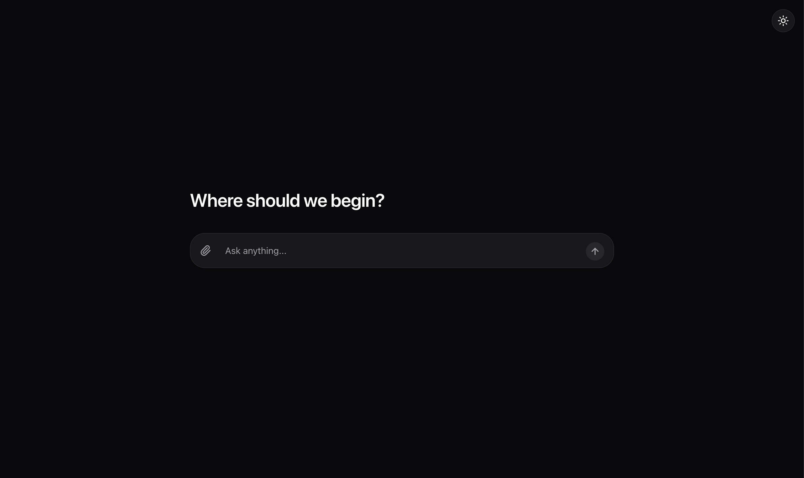

<p align="center">
  
</p>

<h1 align="center">HEYPICO.AI - TEST</h1>

<p align="center">
  <a href="https://heypico-test.vercel.app">
    
  </a>
</p>

A comprehensive full-stack AI-powered location assistant application built with Elysia (Bun) backend and Next.js frontend, featuring intelligent place search using Google Maps API and LLM integration (OpenAI/Ollama).

## 🛠️ Tech Stack

### Backend

| Technology | Version | Why This Choice? |
|------------|---------|------------------|
| **Bun** | 1.2+ | Ultra-fast JavaScript runtime with built-in bundler, test runner, and package manager. ~4x faster than Node.js for HTTP servers. |
| **Elysia** | 1.2.x | Type-safe, high-performance web framework built for Bun. [~21x faster than FastAPI](https://medium.com/deno-the-complete-reference/url-shortener-service-benchmarking-bun-elysia-vs-python-fastapi-9e74857eafe1) in benchmarks. Trusted by AI companies like [Cluely](https://jobs.ashbyhq.com/cluely/9ed623a7-fc2d-4afc-ab88-a01af977cb9f). Offers end-to-end type safety with minimal boilerplate. |
| **Vercel AI SDK** | 4.x | Unified API for LLM providers with streaming support, tool calling, and React hooks integration. Framework-agnostic and production-ready. |
| **Zod** | 3.x | TypeScript-first schema validation with excellent type inference. Perfect pairing with Elysia for request/response validation. |
| **OpenAI/Ollama** | - | Flexible LLM support: OpenAI for production reliability, Ollama for local development and cost-free experimentation. |

### Frontend

| Technology | Version | Why This Choice? |
|------------|---------|------------------|
| **Next.js** | 15.x | React framework with App Router, server components, and built-in optimizations. Industry standard for React production apps. |
| **React** | 19.x | Latest React with improved performance, concurrent features, and better server component support. |
| **TypeScript** | 5.x | Type safety across the entire codebase, catching errors at compile time and improving developer productivity. |
| **@vis.gl/react-google-maps** | 1.x | Official Google Maps React library with modern hooks API and excellent TypeScript support. |
| **Lucide React** | 0.5x | Beautiful, consistent icon set with tree-shaking support. Lightweight alternative to FontAwesome. |
| **React Markdown** | 10.x | Render AI responses with rich formatting (code blocks, lists, links) for better UX. |

### Infrastructure & Tooling

| Technology | Why This Choice? |
|------------|------------------|
| **Turborepo** | Monorepo build system with caching, parallel execution, and dependency management. Speeds up CI/CD significantly. |
| **Turbopack** | Next.js's Rust-based bundler for instant hot module replacement during development. |
| **Docker** | Containerization for consistent deployment across environments. Optimized multi-stage builds for Bun. |
| **Vercel** | Seamless Next.js deployment with automatic previews, edge functions, and global CDN. |

### APIs & Services

| Service | Purpose |
|---------|---------|
| **Google Places API** | Location search, place details, photos, and reviews for intelligent place recommendations. |
| **Google Maps JavaScript API** | Interactive map display with markers, info windows, and custom styling. |
| **OpenAI API** | GPT-4o-mini for production-grade natural language understanding and generation. |
| **Ollama** | Local LLM inference for development and privacy-conscious deployments. |

### Why This Stack?

1. **Performance First**: Bun + Elysia provides one of the fastest backend setups available, handling high-throughput with minimal latency.

2. **Type Safety End-to-End**: TypeScript + Zod + Elysia ensures type consistency from API request to database to frontend response.

3. **Modern React Patterns**: Next.js 15 + React 19 enables server components, streaming, and the latest React optimizations.

4. **AI-Native Architecture**: Vercel AI SDK abstracts LLM complexity, making it trivial to switch between providers or add new ones.

5. **Developer Experience**: Hot reloading, excellent error messages, auto-generated API docs, and monorepo tooling for fast iteration.

6. **Production Ready**: All technologies are battle-tested in production environments with active maintenance and strong communities.

## 📁 Project Structure

```
├── apps/
│   ├── api/                    # Elysia (Bun) backend service
│   │   ├── src/
│   │   │   ├── routes/         # API route controllers
│   │   │   │   ├── chat.routes.ts    # AI chat with streaming
│   │   │   │   └── photos.routes.ts  # Photo proxy endpoints
│   │   │   ├── services/       # Business logic services
│   │   │   │   └── places.service.ts # Google Places API integration
│   │   │   ├── models/         # Zod schemas and types
│   │   │   ├── utils/          # Utility functions (rate limiter)
│   │   │   ├── app.ts          # Elysia application setup
│   │   │   ├── env.ts          # Environment configuration
│   │   │   └── index.ts        # Server entry point
│   │   └── package.json
│   └── web/                    # Next.js frontend application
│       ├── src/
│       │   ├── app/            # Next.js App Router pages
│       │   ├── components/     # React components
│       │   │   ├── ChatInterface.tsx   # Main chat UI
│       │   │   ├── ChatMessages.tsx    # Message rendering
│       │   │   ├── ChatInput.tsx       # User input component
│       │   │   ├── MapCanvas.tsx       # Google Maps integration
│       │   │   ├── PlaceCarousel.tsx   # Place cards display
│       │   │   └── ThemeToggle.tsx     # Dark/light mode toggle
│       │   ├── types/          # TypeScript type definitions
│       │   └── env.ts          # Frontend environment config
│       └── package.json
└── packages/
    ├── eslint-config/          # Shared ESLint configurations
    ├── typescript-config/      # Shared TypeScript configs
    └── ui/                     # Shared UI component library
```

## 🚀 Features Overview

### Core Features Implemented

✅ **AI Chat Interface**
- Interactive chat UI with streaming responses
- Markdown support for rich text responses
- Real-time AI responses using Vercel AI SDK
- Loading states and error handling
- Clear chat functionality

✅ **Intelligent Location Search**
- Natural language processing for location queries
- Google Places API integration for place discovery
- Smart intent detection to determine when location search is needed
- AI-powered tool calling for seamless place recommendations

✅ **Interactive Maps Integration**
- Embedded Google Maps with multiple location markers
- Place details display (name, address, reviews, open status)
- Photo gallery for each place via secure proxy
- Responsive map container with modern UI

✅ **Rate Limiting & Security**
- IP-based rate limiting with X-Forwarded-For support
- Separate rate limits for chat and Google Places API
- CORS protection with configurable origins
- Secure photo proxy (API keys never exposed to client)

✅ **Modern UI/UX**
- Clean, responsive design
- Dark/light theme support with system preference detection
- Mobile-friendly interface
- Intuitive chat bubbles with user/AI distinction

## 🎯 Requirements Achievement

This project successfully meets all the specified requirements:

### ✅ Local/Cloud LLM Integration (OpenAI Compatible API)
- **Flexible LLM Configuration**: Supports both local and cloud LLM providers
- **Cloud Setup**: OpenAI integration (gpt-4o-mini by default)
- **Local Setup**: Ollama integration (llama3.2 by default)
- **Easy Toggle**: Switch between providers via `LLM_PROVIDER` env variable

### ✅ Google Maps Integration
- **Places API**: Text search for finding places based on natural language queries
- **Embedded Maps**: Interactive maps showing search results with markers
- **Place Details**: Rich information display with photos, reviews, and open status
- **Photo Proxy**: Secure backend proxy to serve place photos without exposing API keys

### ✅ Backend API with Best Practices
- **Elysia Framework**: Modern, fast, and type-safe API with Bun runtime
- **Rate Limiting**: Multi-layered rate limiting (global + per-endpoint)
- **Input Validation**: Zod schemas for request/response validation
- **Error Handling**: Comprehensive error responses with proper HTTP status codes
- **API Documentation**: Auto-generated Swagger/OpenAPI docs at `/swagger`

### ✅ Frontend User Interface
- **Next.js 15 + React 19**: Modern, type-safe frontend development
- **Vercel AI SDK**: Seamless streaming chat integration
- **Google Maps**: Interactive maps with `@vis.gl/react-google-maps`
- **Responsive Design**: Works across desktop and mobile devices

## 🧠 LLM Configuration

### Cloud LLM (Default Setup)

The project is configured to use **Cloud LLM (OpenAI)** by default:

```env
# Cloud LLM Configuration (Default)
LLM_PROVIDER=cloud
OPENAI_API_KEY=your_openai_api_key
OPENAI_MODEL=gpt-4o-mini
```

### Local LLM (Ollama)

Local LLM setup using Ollama:

```env
# Local LLM Configuration
LLM_PROVIDER=local
OLLAMA_BASE_URL=http://localhost:11434
OLLAMA_MODEL=llama3.2
```

**Prerequisites for Local LLM:**
1. Install Ollama: https://ollama.ai
2. Pull a model: `ollama pull llama3.2`
3. Ensure Ollama is running: `ollama serve`

## 🛡️ Rate Limiting & Security

### Rate Limiting Implementation

Implemented comprehensive rate limiting to ensure API stability:

```typescript
// Global rate limit: 100 requests per minute per IP
rateLimit({
  duration: 60000,
  max: 100,
  generator: (request, server) => {
    const forwardedFor = request.headers.get("X-Forwarded-For");
    if (forwardedFor) return forwardedFor.split(",")[0].trim();
    return server?.requestIP(request)?.address ?? "";
  }
})

// Chat endpoint: Configurable via CHAT_RATE_LIMIT (default: 10/min)
// Places API: Configurable via GOOGLE_PLACES_RATE_LIMIT (default: 100/min)
```

**Features:**
- ⏱️ IP-based rate limiting with X-Forwarded-For support for proxies
- 🔄 Sliding window algorithm for request tracking
- 📊 Separate rate limits for different endpoints
- ⚠️ Graceful error responses when limits exceeded
- 💾 In-memory storage for rate limit data

**Limitations:**
- ⚠️ Rate limiter uses in-memory storage only (no database integration)
- 🔄 Rate limit data is reset when server restarts
- 📊 Not suitable for distributed/multi-instance deployments
- 💡 Designed for demonstration or single-instance production only

### Security Measures

**Photo Proxy:**
- 🔐 Backend proxy for Google Places photos
- 🔒 API keys never exposed to client-side code
- 📸 Proper content-type and caching headers

**Additional Security:**
- 🌐 CORS protection with configurable origins
- 🛡️ Input validation and sanitization via Zod
- 🚫 No sensitive data logging
- 🔒 Environment-based configuration management

## 🎨 Frontend UI Features

### Chat Interface
- **Modern Design**: Clean chat bubbles with user/AI distinction
- **Streaming Responses**: Real-time AI response streaming
- **Rich Text**: Markdown rendering for formatted responses
- **Interactive Elements**: Buttons, loading states, and animations

### Map Integration
- **Embedded Maps**: Google Maps with interactive markers
- **Multiple Markers**: Display multiple locations simultaneously
- **Place Cards**: Rich information display with photos
- **Responsive Layout**: Adapts to different screen sizes

### User Experience
- **Real-time Updates**: Instant message delivery and streaming responses
- **Error Handling**: User-friendly error messages
- **Loading States**: Visual feedback during API calls
- **Theme Support**: Dark/light mode with system preference detection

## 🔄 Chat Architecture & Flow

This section explains how the AI chat feature works, from user input to displaying place recommendations.

### Architecture Overview

```
┌─────────────────────────────────────────────────────────────────────────────┐
│                              FRONTEND (Next.js)                              │
├─────────────────────────────────────────────────────────────────────────────┤
│                                                                              │
│  ┌──────────────────┐    ┌──────────────────┐    ┌──────────────────┐       │
│  │   ChatInterface  │───▶│   ChatMessages   │───▶│  PlaceCarousel   │       │
│  │   (Main State)   │    │  (Render Messages)│    │  (Display Places)│       │
│  └────────┬─────────┘    └──────────────────┘    └──────────────────┘       │
│           │                                                                  │
│           │ useChat() hook                                                   │
│           ▼                                                                  │
│  ┌──────────────────┐                           ┌──────────────────┐        │
│  │    ChatInput     │                           │    MapCanvas     │        │
│  │  (User Input)    │                           │  (Google Maps)   │        │
│  └────────┬─────────┘                           └──────────────────┘        │
│           │                                                                  │
└───────────┼──────────────────────────────────────────────────────────────────┘
            │ HTTP POST /chat (streaming)
            ▼
┌─────────────────────────────────────────────────────────────────────────────┐
│                              BACKEND (Elysia/Bun)                           │
├─────────────────────────────────────────────────────────────────────────────┤
│                                                                              │
│  ┌──────────────────┐    ┌──────────────────┐    ┌──────────────────┐       │
│  │   chat.routes    │───▶│   Vercel AI SDK  │───▶│   LLM Provider   │       │
│  │  (Rate Limit)    │    │   (streamText)   │    │ (OpenAI/Ollama)  │       │
│  └──────────────────┘    └────────┬─────────┘    └──────────────────┘       │
│                                   │                                          │
│                                   │ Tool Call: showPlaces                    │
│                                   ▼                                          │
│                          ┌──────────────────┐    ┌──────────────────┐       │
│                          │  places.service  │───▶│ Google Places API│       │
│                          │  (Search Places) │    │  (Text Search)   │       │
│                          └──────────────────┘    └──────────────────┘       │
│                                                                              │
└─────────────────────────────────────────────────────────────────────────────┘
```

### Sequence Flow

```
User                Frontend                 Backend                  External APIs
 │                     │                        │                          │
 │  1. Type message    │                        │                          │
 │────────────────────▶│                        │                          │
 │                     │                        │                          │
 │                     │  2. POST /chat         │                          │
 │                     │   {messages, headers}  │                          │
 │                     │───────────────────────▶│                          │
 │                     │                        │                          │
 │                     │                        │  3. streamText()         │
 │                     │                        │─────────────────────────▶│ OpenAI/Ollama
 │                     │                        │                          │
 │                     │                        │  4. LLM decides to       │
 │                     │                        │     call showPlaces tool │
 │                     │                        │◀─────────────────────────│
 │                     │                        │                          │
 │                     │                        │  5. searchPlaces()       │
 │                     │                        │─────────────────────────▶│ Google Places
 │                     │                        │                          │
 │                     │                        │  6. Place results        │
 │                     │                        │◀─────────────────────────│
 │                     │                        │                          │
 │                     │  7. Streaming response │                          │
 │                     │     (text + tool data) │                          │
 │                     │◀───────────────────────│                          │
 │                     │                        │                          │
 │  8. See AI response │                        │                          │
 │     + Place cards   │                        │                          │
 │◀────────────────────│                        │                          │
 │                     │                        │                          │
 │  9. Click place     │                        │                          │
 │────────────────────▶│                        │                          │
 │                     │                        │                          │
 │  10. Map opens with │                        │                          │
 │      place details  │                        │                          │
 │◀────────────────────│                        │                          │
```

### Component Details

#### Frontend Components

| Component | File | Responsibility |
|-----------|------|----------------|
| `ChatInterface` | `ChatInterface.tsx` | Main container managing chat state using `useChat()` hook, user location, and map visibility |
| `ChatMessages` | `ChatMessages.tsx` | Renders message list, extracts places from tool results, displays markdown content |
| `ChatInput` | `ChatInput.tsx` | User input field with submit handling |
| `PlaceCarousel` | `PlaceCarousel.tsx` | Horizontal scrollable cards showing place photos, names, and details |
| `MapCanvas` | `MapCanvas.tsx` | Google Maps integration with markers and info windows |

#### Backend Components

| Component | File | Responsibility |
|-----------|------|----------------|
| `chatRoute` | `chat.routes.ts` | POST `/chat` endpoint with rate limiting, request validation, and LLM integration |
| `showPlaces` tool | `chat.routes.ts` | AI tool that triggers place search when LLM detects location-related queries |
| `PlacesService` | `places.service.ts` | Handles Google Places API calls, rate limiting, and photo URL generation |
| `photosRoute` | `photos.routes.ts` | Proxy endpoint for serving place photos without exposing API keys |

### Key Technical Details

#### 1. Streaming Response
The chat uses Vercel AI SDK's `streamText()` function for real-time streaming:
```typescript
const result = streamText({
  model: getModel(),
  maxSteps: 5,
  system: SYSTEM_PROMPT,
  messages,
  tools: { showPlaces: tool({...}) }
});
return result.toDataStreamResponse();
```

#### 2. Tool Calling
The LLM can call the `showPlaces` tool when it detects the user wants place recommendations:
```typescript
showPlaces: tool({
  description: "Search and show places in a carousel...",
  parameters: ShowPlacesParamsSchema,
  execute: async ({ query, count }) => {
    const places = await searchPlaces(query, count, userLocation);
    return { places };
  }
})
```

#### 3. User Location
The frontend captures user geolocation and sends it via header:
```typescript
headers: userLocation
  ? { "X-User-Location": `${userLocation.lat},${userLocation.lng}` }
  : {}
```

#### 4. Place Data Extraction
The frontend extracts place data from assistant message tool invocations:
```typescript
const places = message.role === "assistant"
  ? extractPlacesFromMessage(message)
  : null;
```

#### 5. Photo Proxy
Photos are served through a backend proxy to keep API keys secure:
```
Frontend Request: GET /photos/{encodedPhotoName}?maxWidth=400
Backend Fetches: Google Places Photo API with API key
Returns: Image stream with proper headers
```

### Data Flow Example

**User Query:** "Find me good coffee shops in Bintaro"

1. **Frontend** sends POST to `/chat` with message and location header
2. **Backend** validates request, applies rate limiting
3. **LLM** analyzes query, decides to call `showPlaces` tool
4. **Tool execution** calls Google Places Text Search API
5. **Places Service** transforms response to `PlaceData[]` format
6. **Streaming response** returns AI text + tool results with places
7. **Frontend** parses response, renders markdown text
8. **PlaceCarousel** displays place cards with photos
9. **User clicks** a place card → **MapCanvas** opens with marker

## 🚀 Quick Start

### Prerequisites

- Bun 1.2+ (or Node.js 18+)
- Google Maps API key (with Places API enabled)
- OpenAI API key (for cloud LLM) OR Ollama (for local LLM)

### Environment Setup

1. **Clone the repository**
   ```bash
   git clone https://github.com/galileor97/heypico.ai-fullstacks-test.git
   cd heypico.ai-fullstacks-test
   ```

2. **Set up API environment variables**
   ```bash
   cp apps/api/env.example apps/api/.env
   ```

   Edit `apps/api/.env` with your configuration:
   ```env
   # LLM Provider: "cloud" or "local"
   LLM_PROVIDER=cloud

   # Cloud (OpenAI) - required when LLM_PROVIDER=cloud
   OPENAI_API_KEY=your_openai_api_key
   OPENAI_MODEL=gpt-4o-mini

   # Local (Ollama) - used when LLM_PROVIDER=local
   # OLLAMA_BASE_URL=http://localhost:11434
   # OLLAMA_MODEL=llama3.2

   # Google Places API (required)
   GOOGLE_PLACES_API_KEY=your_google_places_api_key

   # App Config
   FRONTEND_URL=http://localhost:3000
   PORT=3001
   ```

3. **Set up Web environment variables**
   ```bash
   cp apps/web/.env.local.example apps/web/.env.local
   ```

   Edit `apps/web/.env.local`:
   ```env
   # Google Maps API Key for displaying maps
   NEXT_PUBLIC_GOOGLE_MAPS_API_KEY=your_google_maps_api_key

   # Backend API URL
   NEXT_PUBLIC_API_URL=http://localhost:3001
   ```

### Development Mode

```bash
# Install dependencies
bun install

# Start all services (API + Web)
bun dev
```

**Services will be available at:**
- 🌐 Frontend: `http://localhost:3000`
- 🔧 Backend: `http://localhost:3001`
- 📚 API Docs: `http://localhost:3001/swagger`

### Individual Service Development

**Backend Only:**
```bash
cd apps/api
bun run dev
```

**Frontend Only:**
```bash
cd apps/web
bun run dev
```

## 📖 API Documentation

Once the backend is running, comprehensive API documentation is available at:

- **Swagger UI**: `http://localhost:3001/swagger`

### Main Endpoints

| Endpoint | Method | Description |
|----------|--------|-------------|
| `/` | GET | Welcome message |
| `/health` | GET | Health check endpoint |
| `/chat` | POST | AI chat with streaming response |
| `/photos/:photoName` | GET | Photo proxy for Google Places photos |

### Chat Endpoint

**Request:**
```bash
curl -X POST http://localhost:3001/chat \
  -H "Content-Type: application/json" \
  -d '{
    "messages": [
      {"role": "user", "content": "Find me good restaurants in Jakarta"}
    ]
  }'
```

**Response:** Streaming response with AI-generated text and optional place recommendations.

## 🧪 Testing

### Backend Testing
```bash
cd apps/api
bun test
```

### Frontend Type Checking
```bash
cd apps/web
bun run check-types
```

## 🚀 Production Build

### Build All Services
```bash
bun run build
```

## 🌐 Deployment

### Backend (API) - Docker/Dokploy

The API includes a Dockerfile optimized for Bun runtime:

```bash
# Build from apps/api directory
docker build -t heypico-api ./apps/api

# Run with environment variables
docker run -p 3001:3001 \
  -e OPENAI_API_KEY=your_key \
  -e GOOGLE_PLACES_API_KEY=your_key \
  -e API_BASE_URL=https://your-api-domain.com \
  -e FRONTEND_URL=https://your-frontend-domain.com \
  heypico-api
```

**Environment Variables for Production:**
- `API_BASE_URL`: Your production API URL (for photo proxy URLs)
- `FRONTEND_URL`: Your frontend URL (for CORS)

### Frontend (Web) - Vercel

1. Connect your repository to Vercel
2. Set the Root Directory to `apps/web`
3. Add environment variable:
   - `NEXT_PUBLIC_API_URL`: Your backend API URL
   - `NEXT_PUBLIC_GOOGLE_MAPS_API_KEY`: Your Google Maps API key
4. Deploy!

### Environment Variables Reference

| Variable | Description | Required | Default |
|----------|-------------|----------|---------|
| `LLM_PROVIDER` | LLM provider: "cloud" or "local" | No | `cloud` |
| `OPENAI_API_KEY` | OpenAI API Key | Yes* | - |
| `OPENAI_MODEL` | OpenAI model name | No | `gpt-4o-mini` |
| `OLLAMA_BASE_URL` | Ollama server URL | No | `http://localhost:11434` |
| `OLLAMA_MODEL` | Ollama model name | No | `llama3.2` |
| `GOOGLE_PLACES_API_KEY` | Google Places API Key | Yes | - |
| `API_BASE_URL` | Backend URL for photo proxies | No | `http://localhost:3001` |
| `FRONTEND_URL` | Frontend URL for CORS | No | `http://localhost:3000` |
| `PORT` | Backend server port | No | `3001` |
| `CHAT_RATE_LIMIT` | Chat requests per minute | No | `10` |
| `GOOGLE_PLACES_RATE_LIMIT` | Places API requests per minute | No | `100` |
| `PLACES_MAX_COUNT` | Maximum places to return per search | No | `5` |

*Required when `LLM_PROVIDER=cloud`

## 🔧 Troubleshooting

### Common Issues

1. **LLM Connection Issues**
   - Verify API keys are correct
   - For local LLM, ensure Ollama is running: `ollama serve`
   - Check model is available: `ollama list`

2. **Google Maps Not Loading**
   - Verify API keys have proper permissions
   - Check API quotas in Google Cloud Console
   - Ensure Maps JavaScript API and Places API are enabled

3. **Rate Limiting Errors**
   - Wait for rate limit window to reset (1 minute)
   - Adjust rate limits in environment configuration
   - Check if rate limits are applied correctly

4. **CORS Errors**
   - Verify `FRONTEND_URL` matches your frontend origin
   - Check if backend is running on correct port

### Development Tips

- 📊 Backend auto-reloads on code changes (Bun watch mode)
- ⚡ Frontend supports hot module replacement (Turbopack)
- 📚 API documentation is automatically generated from Elysia schemas
- 🤖 Test local LLM via Ollama CLI before integrating

---

